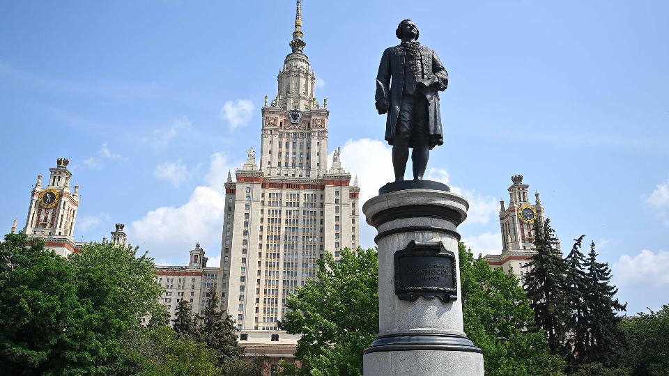
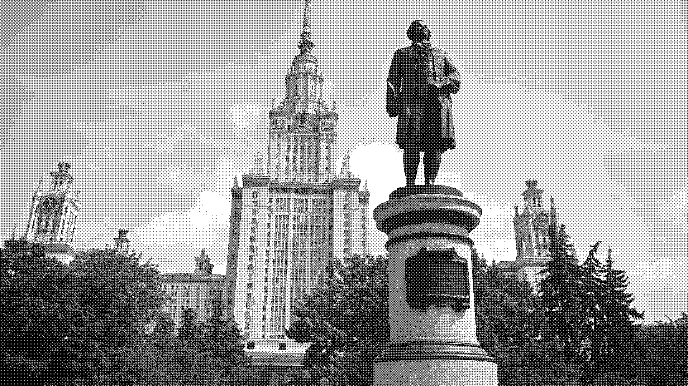
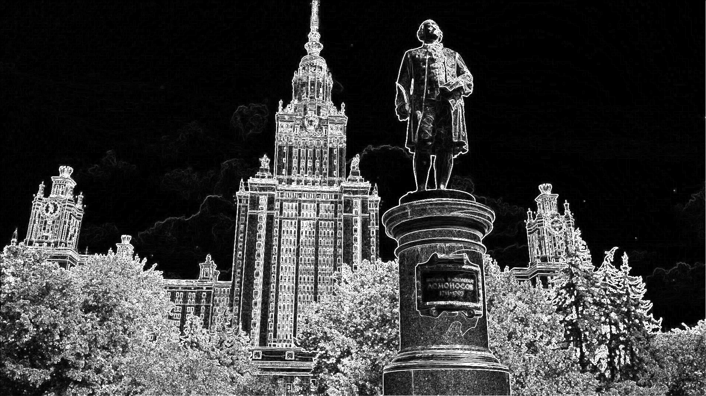

# Photorofls
Simple program to do some manipulations with images:
1. Upscale image by int number
2. Downscale image by int number
3. Apply Floyd-Steinberg dithering on image
4. Invert image colors
5. Apply sine function on image(idk really)
6. Apply Sobel filter on image
## Running
`./photorofls --help` - to get help: 
```
An example of app usage

Usage: photorofls [OPTIONS]

Options:
-f, --filepath <FILE>       Supported formats: bmp, jpeg, png, ico, tga, tiff, webp, exr
-l, --downscale <Scale by>  Downscale image by integer value
-u, --upscale <Scale by>    Upscale image by integer value
-d, --dither                Dither image
-i, --invert                Invert image colors
-t, --trig                  Apply sine on image(idk)
-s, --sobel                 Apply Sobel filter on image
-h, --help                  Print help
```
## Examples
1. Upscale `./photorofls -f mgy.jpg -u 2` 
2. Downscale `./photorofls -f mgy.jpg -l 2` 
3. Floyd-Steinberg `./photorofls -f mgy.jpg -d` 
4. Invert `./photorofls -f mgy.jpg -i` 
5. Sine `./photorofls -f mgy.jpg -t` 
6. Sobel filter `./photorofls -f mgy.jpg -s` 
## Building
`cargo build --release --target <your target>`
### For example
- For linux x86/x64 (gnu compiler) `cargo build --release --target x86_64-unknown-linux-gnu`
- For Windows x86/x64 (gnu compiler) `cargo build --release --target x86_64-pc-windows-gnu`
